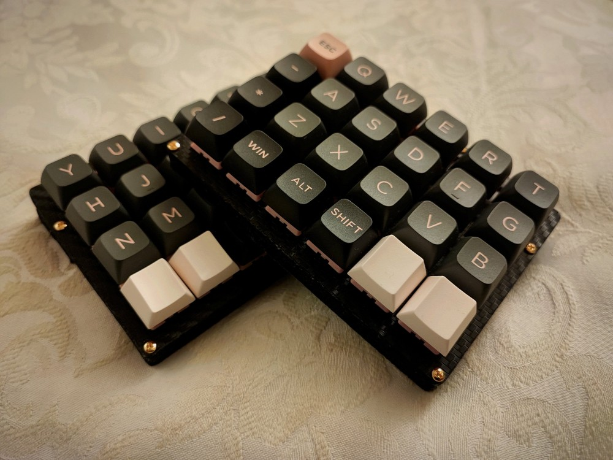
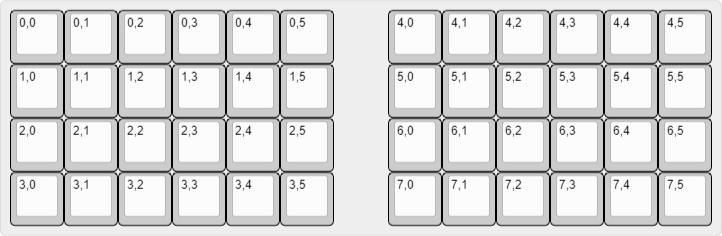

# Let's Swamp

<!--  -->

DIY keyboard "Let's Swamp"

---

## ⌨️What is "Let's Swamp" ?

Let's Swamp is an ortholinear split keyboard.

 * 4x6x2=48keys
 * Controller board : Waveshare RP2040-Zero
 * Supported firmware :
    - [Kermite](https://kermite.org/)
    - [PRK Firmware](https://github.com/picoruby/prk_firmware)
    - [QMK Firmware](https://docs.qmk.fm/#/)

---

## 📃License

 * KiCad design files (in [`design`](./design/) directory) : MIT
<!--
 * Gerber files (in `gerber` directory)  : CC-BY-NC
-->
 * Other files: MIT
 
I have modified [Salicylic-acid3/KiCAD_FootPrint](https://github.com/Salicylic-acid3/KiCAD_FootPrint) to use in this project.
