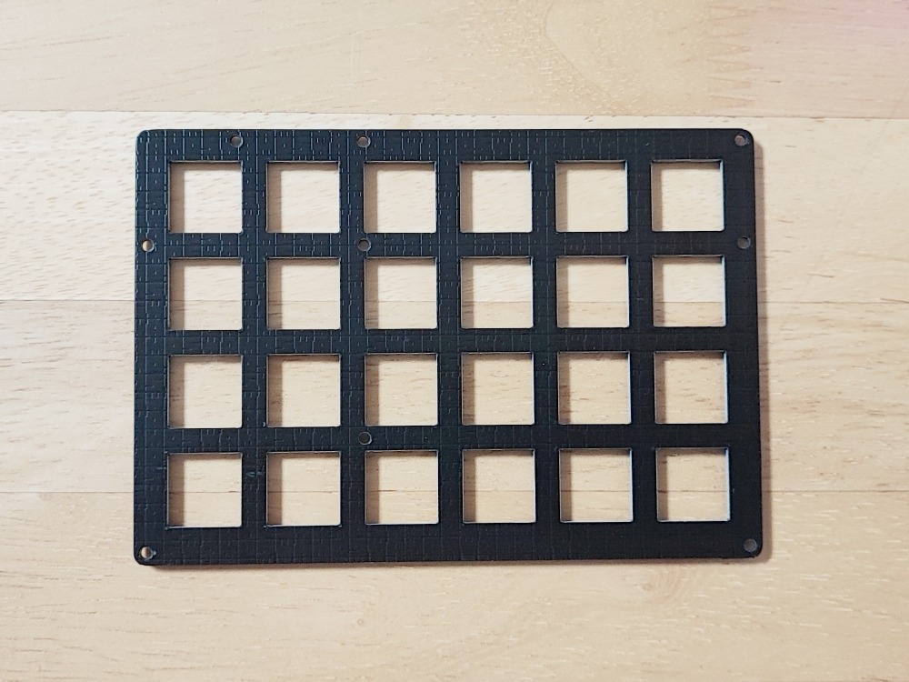
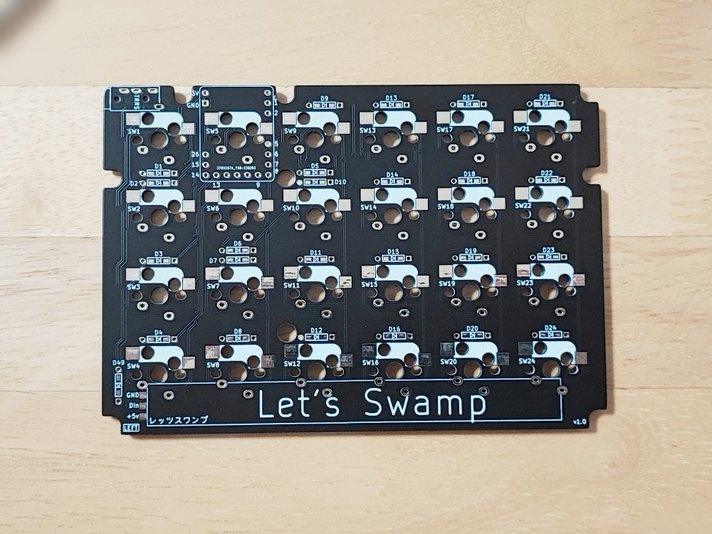
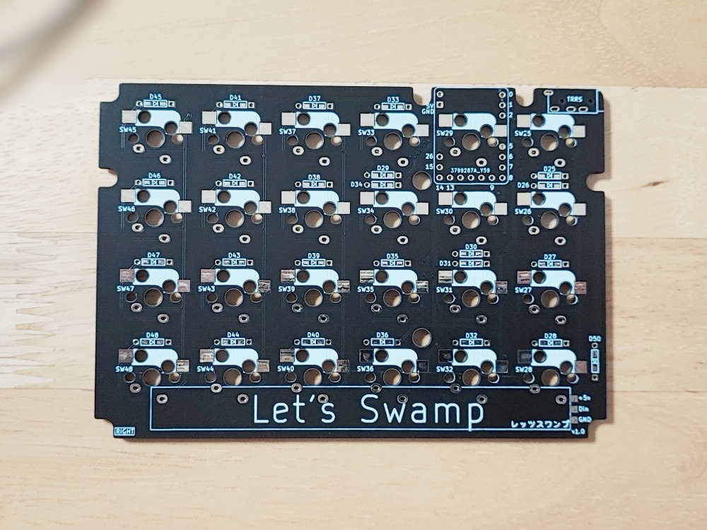
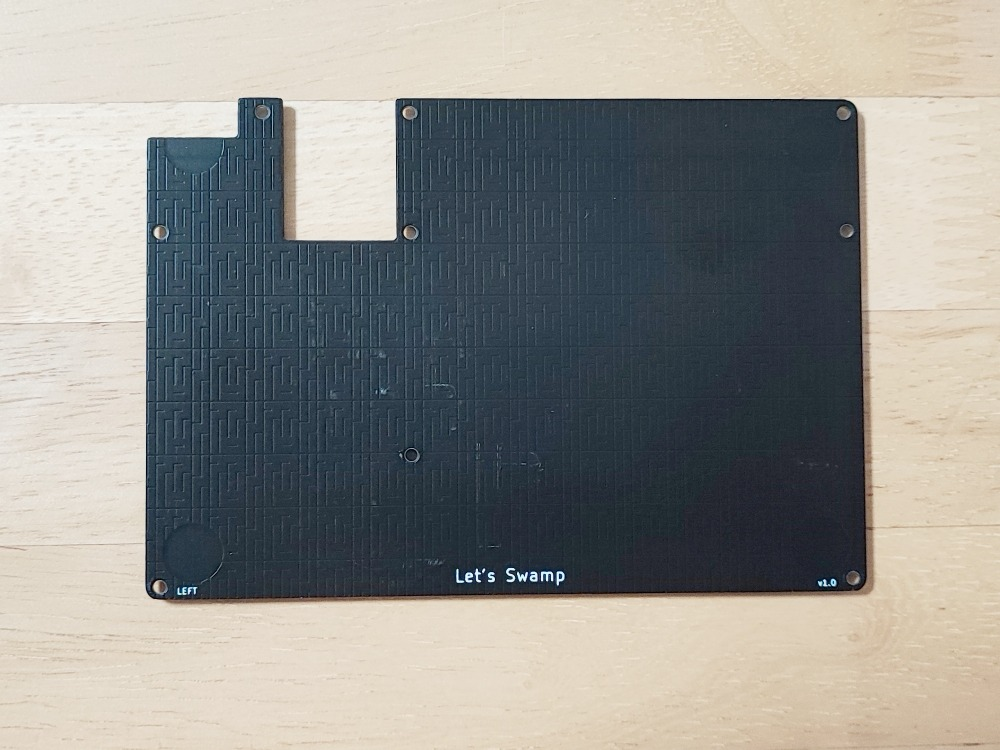
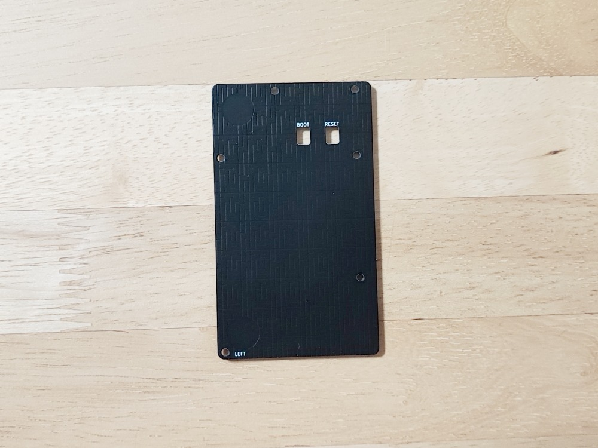
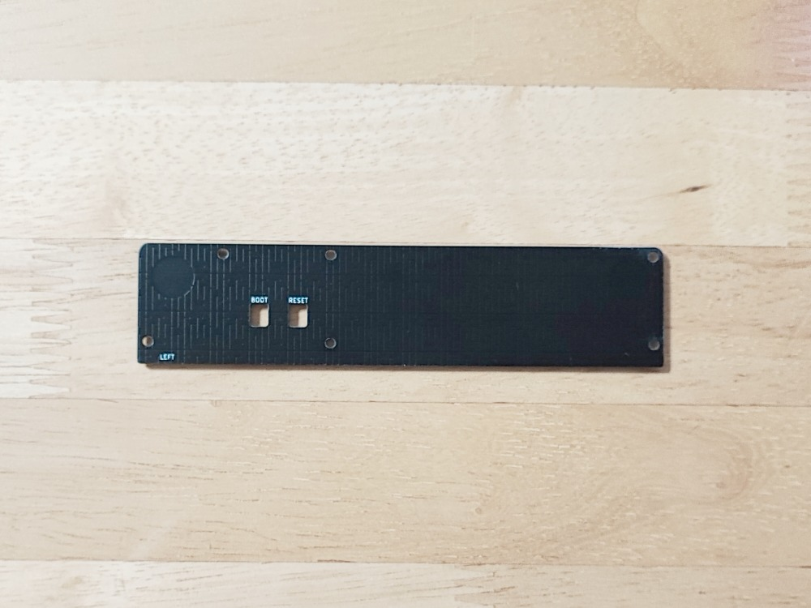
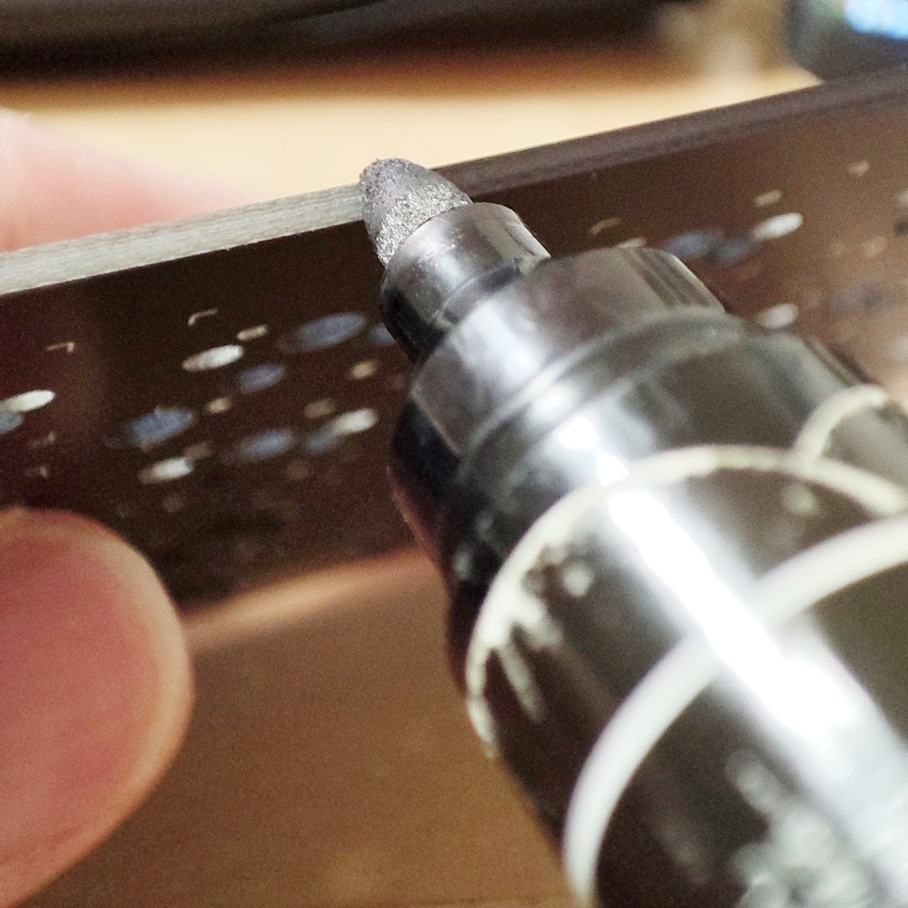
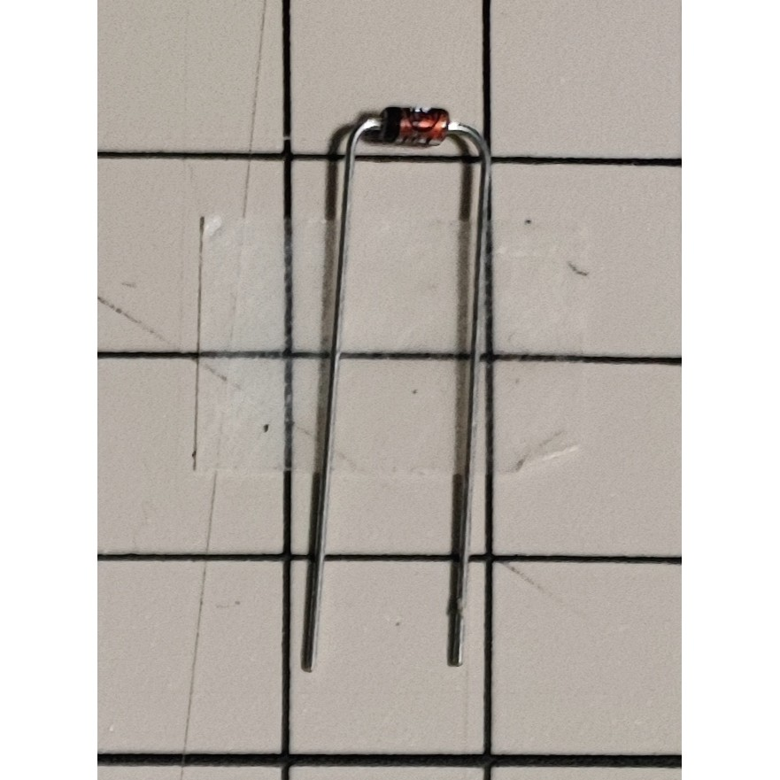

自作キーボード「Let's Swamp」のビルドガイド（組立手順説明書）です。

## 0. はじめに

基本的に、章番号の数字の順序どおりに読み作業を進めてください。

例1：
14-1. Pi PicoにPRK Firmware書き込み
14-2. Pi Picoにテスト用keymap.rb書き込み
→14-1.の次に14-2.を行ってください

ただし、数字ではなく英字の章番号が出てくることがあります。その場合、いずれかの作業を選んで行ってください。

例2：
5-A. ダイオード（スルーホールタイプ）のはんだ付け
5-B. ダイオード（表面実装タイプ）のはんだ付け
→5-A.と5-B.の**いずれかのみ**を行ってください

---

## 1. 構成の選択

どのような構成で組み立てるか、を選択します。使用する部品に影響します。

### 1-1. キースイッチの取り付け方法

キースイッチを基板に取り付ける方法を選択します。

 * ソケットを使用する
   - メリット：キースイッチを後から交換できる
   - デメリット：意図せずキースイッチが外れてしまうことがある（そうそうありませんが）
 * 基板にはんだ付け
   - メリット：キースイッチが外れることはまずない
   - デメリット：キースイッチ破損時に交換することが困難

### 1-2. RP2040-Zeroの取り付け方法

RP2040-Zeroを基板に取り付ける方法を選択します。

 * コンスルーで取り付ける
   - メリット：破損時の取り外しが容易、はんだ付けが少なくて済む
   - デメリット：入手性に若干の難がある（特に日本国外）
 * ピンソケット＋ピンヘッダーで取り付ける
   - メリット：入手しやすい
   - デメリット：破損時の取り外しは少し力が要る、はんだ付けが少し多くなる

### 1-3. ミドルプレート類（各種プレートの間にはさむアクリル）

基板などの間にアクリル製のプレートをはさむかどうかを選択します。

 * 使用する
   - メリット：側面が空かない
   - デメリット：その分価格が上がる
 * 使用しない
   - メリット：安価に仕上がる
   - デメリット：側面が空く

### 1-4. キーボードの傾け方

キーボードをどのように傾けるのかを選択します。

 * チルト（奥が高く手前が低い）
 * テント（中央が高く両脇が低い）

### 1-5. LEDテープ

LEDテープを取り付けてアンダーグロウを有効にするかどうかを選択します。

 * 取り付ける
 * 取り付けない

### 1-6. 工程の確認

構成を選択したら、以降のビルドガイドを一通り読み、必要な工程をイメージします。

---

## 2. 必要な部品の調達

### 2-1. 基板製造業者に注文する部品

|画像|名称・数量・ガーバーデータ|備考|
|:---|-----------------------|----|
||[スイッチプレート](../../design/11_LetsSwamp_SwitchPlate_LR) ×2 [11_LetsSwamp_SwitchPlate_LR_1.6mm.zip](../../gerber/11_LetsSwamp_SwitchPlate_LR_1.6mm.zip)|厚さ1.6mm 左右共用|
||[実装基板（左用）](../../design/21_LetsSwamp_Assemble_L) ×1 [21_LetsSwamp_Assemble_L_1.6mm.zip](../../gerber/21_LetsSwamp_Assemble_L_1.6mm.zip)|厚さ1.6mm|
||[実装基板（右用）](../../design/) ×1 [22_LetsSwamp_Assemble_R_1.6mm.zip](../../gerber/22_LetsSwamp_Assemble_R_1.6mm.zip)|厚さ1.6mm
||[ボトムプレート](../../design/) ×2 [41_LetsSwamp_BottomPlate_LR_0.8mm.zip](../../gerber/41_LetsSwamp_BottomPlate_LR_0.8mm.zip)|厚さ0.8mmまたは0.6mm 左右共用|
||[テントプレート](../../design/) ×2 [61_LetsSwamp_TentPlate_LR_0.8mm.zip](../../gerber/61_LetsSwamp_TentPlate_LR_0.8mm.zip)|厚さ0.8mmまたは0.6mm 左右共用 チルトにする場合は不要|
||[チルトプレート](../../design/) ×2 [81_LetsSwamp_TiltPlate_LR_0.8mm.zip](../../gerber/81_LetsSwamp_TiltPlate_LR_0.8mm.zip) |厚さ0.8mmまたは0.6mm 左右共用 テントにする場合は不要|

### 2-2. アクリルカット業者に注文するミドルプレート類

これらミドルプレート類は省略可能です。使用しなくてもキーボードとしての動作に支障はありません。

|画像|名称・数量|備考|
|:---|---------|----|
||[トップカバープレート](../../design/01_LetsSwamp_TopCoverPlate_LR) ×2|スイッチプレートの上に置く 左右共用|
||[ミドルプレート（左用）](../../design/31_LetsSwamp_MiddlePlate_L) ×1|実装基板（左用）とボトムプレートの間に置く|
||[ミドルプレート（右用）](../../design/32_LetsSwamp_MiddlePlate_R) ×1|実装基板（右用）とボトムプレートの間に置く|
||[ミドルテントプレート](../../design/51_LetsSwamp_MiddleTentPlate_LR) ×2|ボトムプレートとテントプレートの間に置く 左右共用|
||[ミドルチルトプレート](../../design/71_LetsSwamp_MiddleTiltPlate_LR) ×2|ボトムプレートとチルトプレートの間に置く 左右共用|
||[ミドルスイッチプレート](../../design/91_LetsSwamp_MiddleSwitchPlate_LR) ×2セット|スイッチプレートと実装基板の間に置く 左右共用|

### 2-3. その他の部品

| |名称|数量|当記事での略称|備考|
|-|:---|--:|:------------:|:---|
||RP2040-Zero|2|||
||コンスルー（高さ3.5mm）|12ピンなら3本、20ピンなら2本（片手につき17ピン分が必要）|コンスルー|ピンソケットとピンヘッダーを使用する場合は不要|
||ピンソケット|2セット||ピンソケットとピンヘッダーを使用する場合は不要|
||ピンヘッダー|2||コンスルーを使用する場合は不要|
||TRRSジャック|2|||
||ダイオード|48～50||LEDテープを使用する場合は50、使用しない場合は48|
||CherryMX互換キースイッチ|48|キースイッチ||
||CherryMX互換キースイッチ用ソケット|48|スイッチソケット|キースイッチを基板に直接はんだ付けする場合は不要|
||キーキャップ|48||CherryMX互換キースイッチ用|
||LEDテープ|2||アンダーグロウを使用しない場合は不要|

ネジ

M2 3mm x9x2
M2 8mm x7x2
M2 4mm x2x2
スペーサー
M2 丸 8mm 両メネジ x9x2

M2 丸 6mm オネジメネジ x6x2

---

## 3. 必要な器具や消耗品の調達

組み立てに必要となるであろう器具や消耗品を調達します。
代表的な購入先のURL（Amazon.co.jpのものはアフィリエイトリンクです）も載せましたので、参考にしてください。
※すべてが必須というわけではありません

| |名称|購入先|当記事での略称|備考|
|-|:--:|:-----|:-------------|:---|
||はんだこて|[Amazon.co.jp](https://amzn.to/3rcp4XU)||温度が調節できるものがお勧め|
||こて台|[Amazon.co.jp](https://amzn.to/3umqxNB)|||
||はんだ|[Amazon.co.jp](https://amzn.to/3NXWuTQ)|||
||はんだ吸い取り線|[Amazon.co.jp](https://amzn.to/3NTm24L)|||
||はんだ付け作業用マット|[Amazon.co.jp](https://amzn.to/3ujJn7H)|||
||ニッパー|[Amazon.co.jp](https://amzn.to/3jg0j8P)|||
||ピンセット|[Amazon.co.jp](https://amzn.to/3DQsZyK)|||
||マスキングテープ|[Amazon.co.jp](https://amzn.to/35UwPKS)||一般的なマスキングテープでOKです|
||両面テープ|[Amazon.co.jp](https://amzn.to/35UwPKS)||厚み0.4mm程度の剥がせるタイプの両面テープが適しています|
||ドライバー|[Amazon.co.jp](https://amzn.to/3v0o8XT)|||
||キーキャップ引き抜き工具|[TALPKEYBOARD](https://talpkeyboard.net/items/618f33fb2b3ca124f8949427)|||
||パソコン|[Amazon.co.jp](https://amzn.to/3DPAZQI)|||
||テスター|[ヨドバシ.com](https://www.yodobashi.com/product/100000001003656053/)||キーボードがうまく動作しない場合の原因調査に使用します|
||油性ペン（黒）|[Amazon.co.jp](https://amzn.to/3r7pQW3)||改めて購入しなくても、ご家庭にあるもので十分です|
ラジオペンチ

---

## 4. 組み立て前の準備

以下の3つの部品について、側面を油性ペン（黒）で塗ります。

 * スイッチプレート
 * 実装基板（左用、右用）
 * ボトムプレート
 * テントプレート
 * チルトプレート

塗らなくても動作に影響はありませんが、見栄えがよくなりますので塗ることをお勧めします。

---

## 5. ダイオードのはんだ付け

実装基板にダイオードをはんだ付けします。左右両方に行います。

### 5-A. ダイオード（スルーホールタイプ）のはんだ付け

**※この5-A.を行う場合、「5-B. ダイオード（表面実装タイプ）のはんだ付け」は不要です**

  
基板を裏側（Let's Swampと書かれた側）が見える向きに置きます。   
&nbsp;

  
ダイオードの足を適切な長さで曲げます。  
&nbsp;

ダイオードをD1からD50の各穴に差し込みます。なお、LEDテープを取り付けない場合はD49とD50には取り付け不要です。  
&nbsp;
  
  
ダイオードを差し込む際は向きに注意してください。基板に書かれた三角形の先端とダイオードの黒い方が合うようにします。  
&nbsp;

  
ダイオードを一通り差し込んだら、マスキングテープを貼り付けて固定します。  
&nbsp;

  
基板をひっくり返し、表が見える向きに置きます。  
&nbsp;

  
基板の表に飛び出したダイオードの足を、ニッパーで切り取ります。
切り取る際は、足が飛んでいかないよう押さえながら切り取ってください。  
&nbsp;

  
ダイオードの足を基板にはんだ付けします。  
&nbsp;

すべてのダイオードのはんだ付けが終わったら、基板をひっくり返してマスキングテープをはがします。

### 5-B. ダイオード（表面実装タイプ）のはんだ付け

**※この5-B.を行う場合、「5-A. ダイオード（スルーホールタイプ）のはんだ付け」は不要です**

表面実装タイプのダイオードを使用することも可能です。詳細な説明は割愛しますが、向きに注意してはんだ付けしてください。

---

## 6. RP2040-Zeroの取り付け

### 6-A. コンスルーを使用して取り付け

**※この6-A.を行う場合、「6-B. ピンソケットとピンヘッダーを使用して取り付け」は不要です**

  
RP2040-Zero1個につき、コンスルーをニッパー等で以下のように切り離します。

 * 2ピン x1
 * 3ピン x2
 * 4ピン x1
 * 5ピン x1

切り離した端にバリが残っていたら、少し切り取ってある程度平らにしておきます。
&nbsp;

  
切り離したコンスルーをRP2040-Zeroにはんだ付けします。向きに気を付けてください。
ボタンが無い面に差し込み、ボタンがある面にはんだ付けします。
また、金色の点がRP2040-Zero側に近くなるようにします。

### 6-B. ピンソケットとピンヘッダーを使用して取り付け

**※この6-B.を行う場合、「6-A. コンスルーを使用して取り付け」は不要です**

  
RP2040-Zero1個につき、ピンソケットをニッパー等で以下のように切り離します。

 * 2ピン x1
 * 3ピン x2
 * 4ピン x1
 * 5ピン x1

切り離した端にバリが残っていたら、少し切り取ってある程度平らにしておきます。
&nbsp;

  
切り離したピンソケットを基板に差し込みます。  
&nbsp;

ピンヘッダのピンをラジオペンチなどで引き抜きます。

  
その上にRP2040-Zeroを置き、ピンヘッダのピンを差し込みます。  
&nbsp;

  
マスキングテープで固定します。

  
ピンソケットを基板にはんだ付けします。

  
差し込んだピンをRP2040-Zeroにはんだ付けします。

## 7. TRRSジャックの取り付け

  
基板裏の「TRRS」と書かれた場所に、TRRSジャックを差し込みます。

基板をひっくり返し、表からはんだ付けします。

## 8. ミドルスイッチプレートの取り付け

**※この工程はオプションです。ミドルプレート類を使用しない場合は省略可能です。**

ミドルスイッチプレートの保護シートを剥がします。

  
写真を参考にして、ミドルスイッチプレートを両面テープで基板に貼り付けます。

## 9. キースイッチの取り付け

### 9-A. キースイッチソケットをはんだ付けしてスイッチを取り付け

**※この9-A.を行う場合、「9-B. キースイッチをはんだ付け」は不要です**

基板の裏に、スイッチソケット用パッドがあります。そのパッドの片側に予備はんだ（少量のはんだを溶かして乗せておく）をします。

スイッチソケットを乗せます。その際、スイッチソケットの向きに注意してください。スイッチソケットの枠の塗りつぶしが見える場合は向きが間違っています。

予備はんだをはんだこてで溶かし、スイッチソケットをはんだ付けします。

予備はんだしなかった方のパッドもはんだ付けします。

スイッチプレートの向きを確認します。
基板のへこんでいるところにスイッチプレートのネジ穴がくるような向きが正しい向きです。

スイッチプレートの穴にキースイッチを差し込みます。
キースイッチの金属足が上にくるように差し込みます。

基板にキースイッチを差し込みます。
キースイッチ取り付けの際は、スイッチソケットを押さえながらキースイッチを押し込むようにしてください。スイッチソケットを押さえないと、スイッチソケットが剥がれてしまうことがあります。

### 9-B. キースイッチをはんだ付け

**※この9-B.を行う場合、「9-A. キースイッチソケットをはんだ付けしてスイッチを取り付け」は不要です**

トッププレートの穴にキースイッチを差し込み、さらに基板にキースイッチを差し込みます。
キースイッチの金属足が下にくるように差し込みます。

LEDテープを取り付ける場合は、キースイッチの金属足の出っ張った部分を切っておきます。

キースイッチを基板にはんだ付けします。

## 10. LEDテープの取り付け

**※この工程はオプションです。LEDテープを使用しない場合は省略可能です。**

LEDテープの青いカバーをはがし、粘着面を露出させます。

基板裏の枠で囲まれた部分にLEDテープを貼り付けます。
LEDテープの貼り付け位置は、写真を参考にしてください。
LEDテープの貼り付け方向に注意してください。方向を間違えると光りません。
基板のLEDテープ用パッド3つ（+5V、Din、GND）とLEDテープをはんだ付けします。

## 11. プレート類の取り付け

上から
スイッチプレート
ミドルスイッチプレート
実装基板
ミドルプレート
の順に重ねます。ネジ穴の位置が合うようにしてください。

裏返し、写真の位置の穴に8mmスペーサーを差し込みます。

先ほど差し込んだスペーサーを表側から4mmネジで固定します。

トップカバープレートをスイッチプレートの上に乗せ、8mmネジとスペーサーで7か所固定します。

裏返し、ボトムプレートを乗せます。
6mmオネジメネジスペーサーで6か所固定します。
固定する位置は、チルトプレートを使うかテントプレートを使うかで異なります。
写真を参考にしてください。

3mmネジで3か所固定します。

ミドルチルトプレートまたはミドルテントプレートを乗せます。
TRRSジャックのへこみがあるほうを先に乗せます。

さらにチルトプレートまたはボトムプレートを乗せ、3mmネジで6か所固定します。

## 12. ゴム足の取り付け

## 13. キーキャップの取り付け

## 14. ファームウェアの書き込み

## 15. 動作確認

